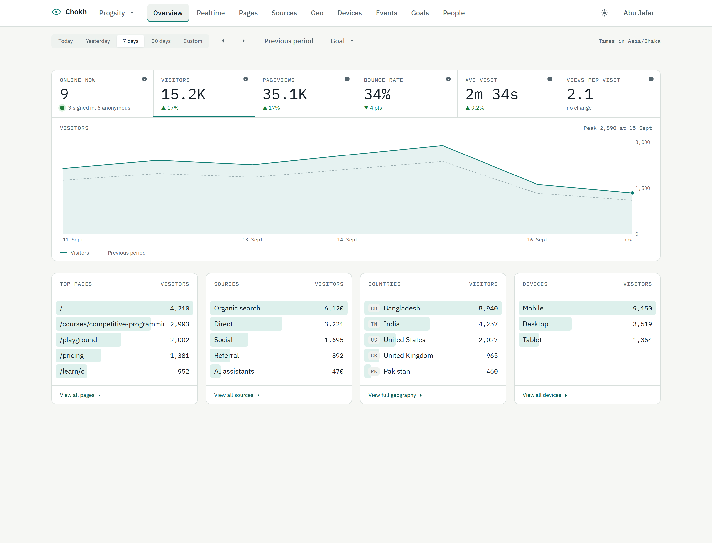
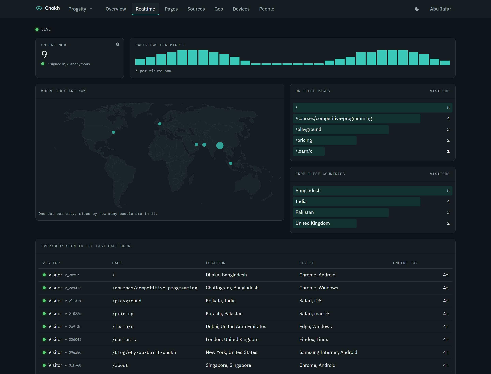
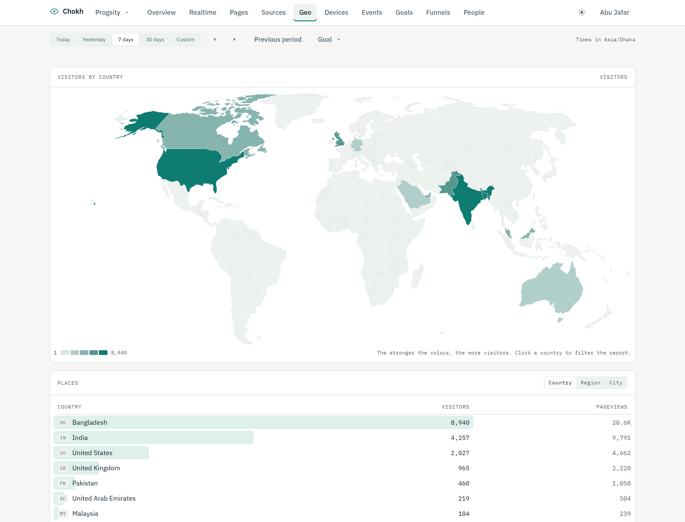
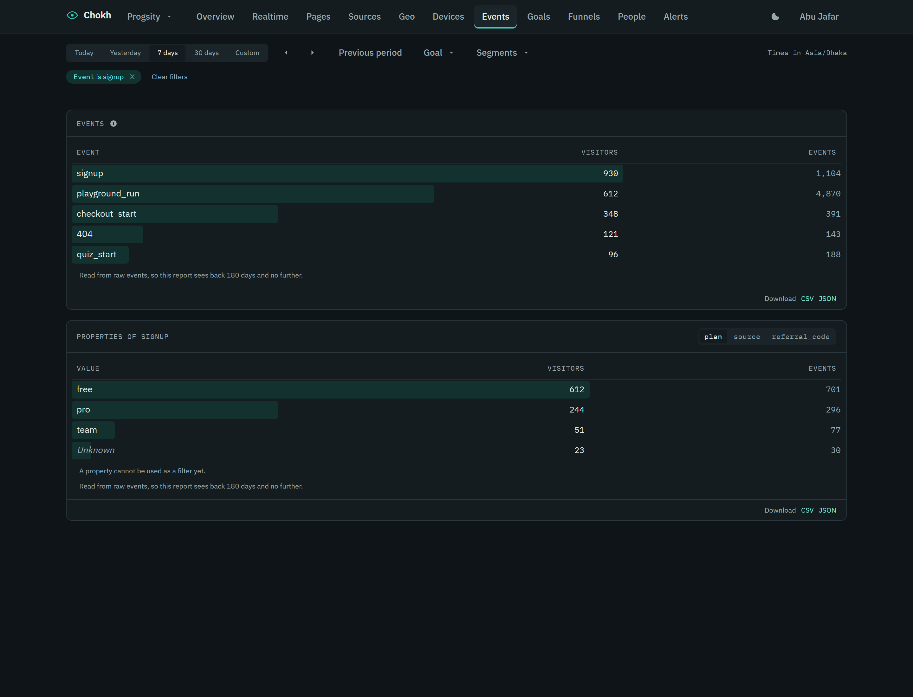
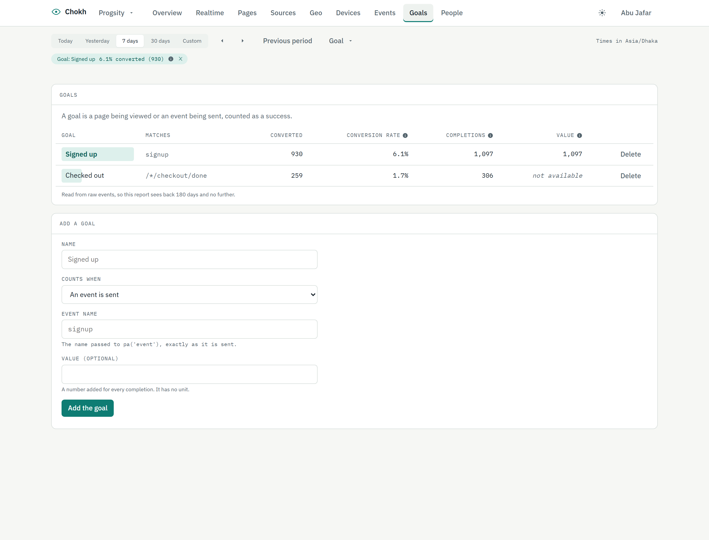
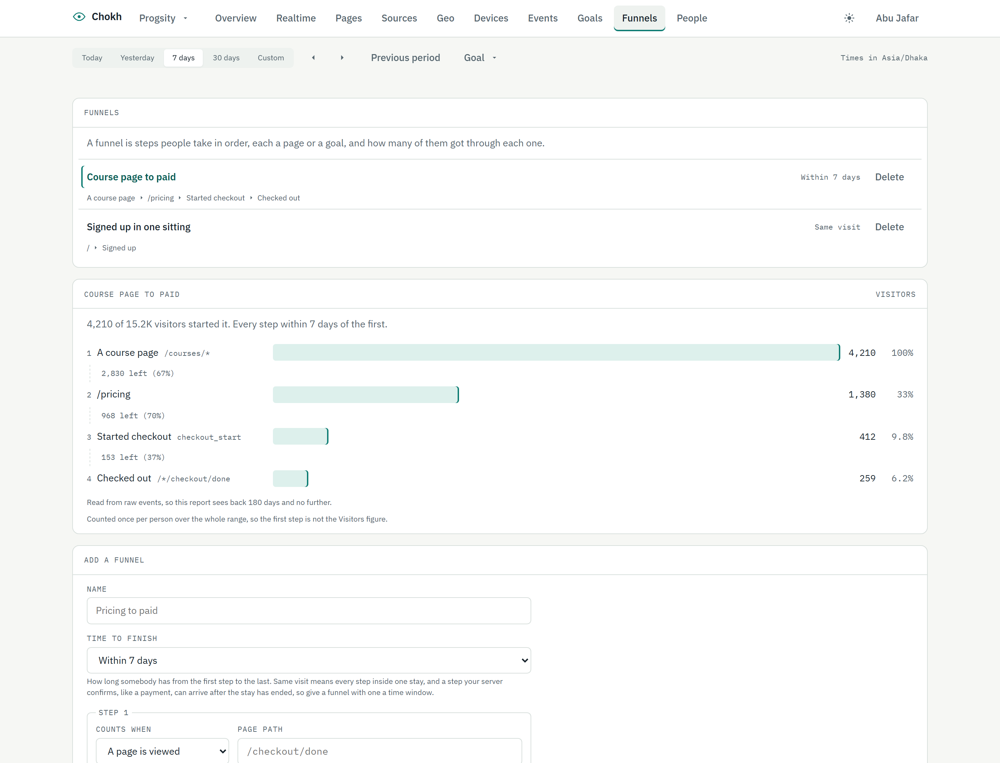
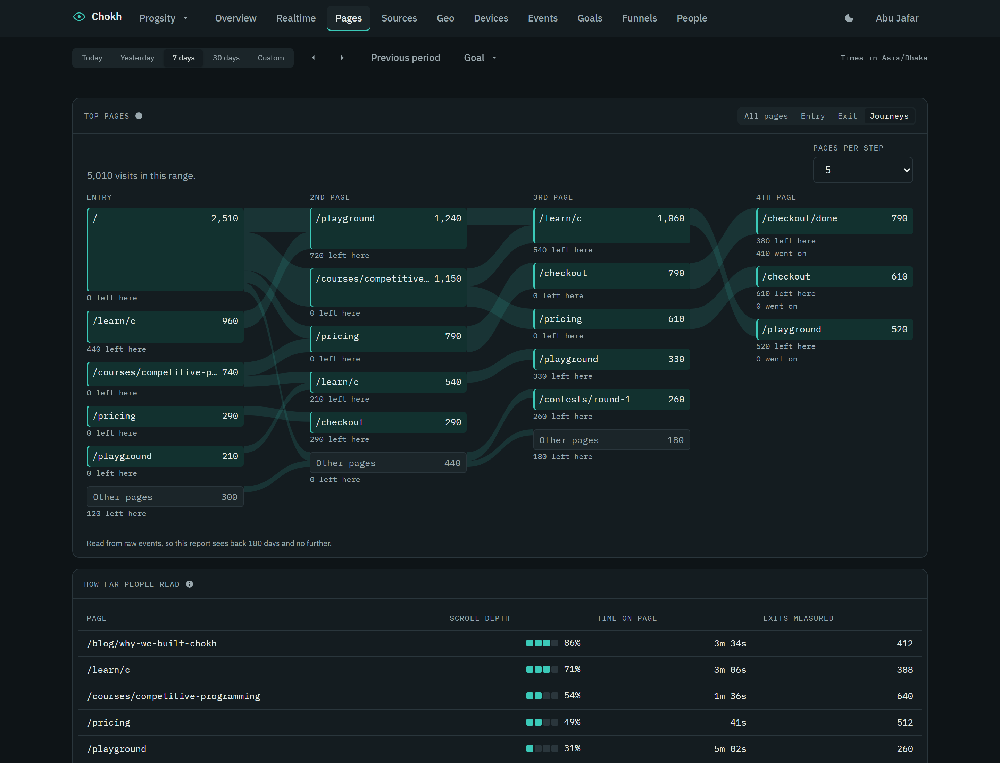
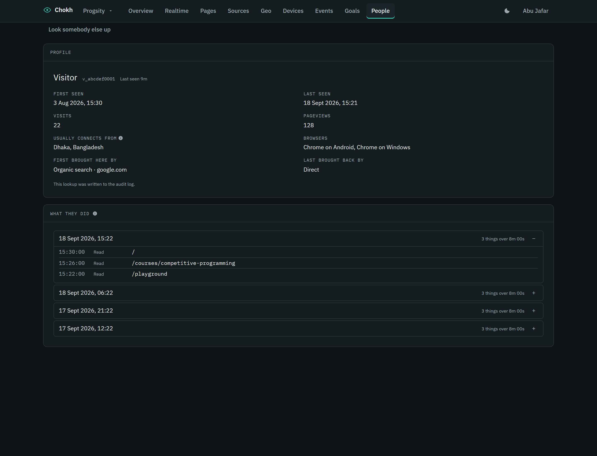

# Chokh

**Status: pre-release.** Nothing here is stable yet. The engine is being built
ticket by ticket; see [AGENTS.md](AGENTS.md) for how the work is run.

Chokh (চোখ, "eye") is open source, first-party web analytics you host
yourself. One process carries the whole product: a tracker script under 3 KB,
a collector, a stats API, a realtime stream and a dashboard.

## What it gives you

- Visitors, visits, pageviews, bounce and visit duration, with compare
- Pages, entry and exit pages, time on page and scroll depth
- Referrers, channels (including AI assistants) and UTM campaigns
- Country, region and city from an offline IP database, plus browser, OS and device
- Who is on the site right now, which page they are on and how long they have been there
- Custom events, `identify` for signed-in people, and per-person history
- Goals with a conversion column on every report, funnels with the drop-off at
  every step, and the paths visits took from the page they came in on
- Segments: any filter list saved under a name, applied in one press and drawn
  against the chart as a second line; route groups that fold `/courses/:slug`
  into one row; and the site's own traffic kept out by address, path or query
  parameter
- Privacy as configuration: cookieless or persistent visitor ids, full, anonymised or
  no IP storage, bot filtering, per-site retention
- A JSON API for all of it, with a CSV export and a live stream of who is here
- Accounts, teams and API keys, and a scope of its own for reading addresses and
  identified people, with an audit row for every such read
- Single sign-on, so a staff member clicks through from your own admin panel and
  is already signed in

## The dashboard



Six numbers, one chart, four cards, and nothing else on the first screen. Every
number carries a comparison, because a number on its own is not something
anybody can act on. Clicking any row filters the whole page rather than opening
another one: click a country and the pages, the sources and the devices become
that country's.

The five rules it is designed around:

1. The first screen answers the question. Everything else is a report somebody
   asked for.
2. Every number carries a comparison.
3. One accent colour. Green and red mean good and bad, never "this series" and
   "that series".
4. Any row can be clicked to filter, and a row that cannot be filtered is not
   dressed up as one that can.
5. Nothing pretends. A read that failed says so instead of drawing a zero, a
   number nobody measured says "not available" instead of 0, and a page nobody
   has closed yet has no time on page rather than a time of nought.

**Realtime** is the report that says who, and not only how many.



Online first, then everybody seen in the last half hour in a muted tone,
because a page that empties at three in the morning reads as broken. The map
places a dot per city from coordinates that were rounded to two decimals, about
a kilometre, when the presence entry was written: what is kept is where a city
is, and it was never anything finer. An address is a different matter and
appears only for an account with `read:identity`, which is said on screen along
with the fact that the read was logged.

**Geography** paints five bands on a log scale.



A continuous ramp looks more precise and reads worse: nobody can tell 1,400
from 1,700 by shade, and on analytics data a linear scale paints the world in
the lightest band with one country in the darkest. The outlines are projected
once at build time and shipped as path strings, so no browser downloads a
mapping library to draw a file that never changes.

**Events** lists what your pages and your server said happened, by name.



A page timing is not an event and is not in the list. Clicking an event filters
the page to it, the same as any other row, and the card under it breaks that
event down by the properties it carried: one tab per property, most used first,
and an Unknown row for the times it was sent without one, so the rows add up to
the event.

**Goals** turn a page or an event into a success, and every report can then be
read against one.



A goal is a page being viewed (a `*` stands for one part of the path, so
`/*/checkout/done` covers every locale prefix) or an event being sent, with an
optional value that is a plain number with no unit. Choose one in the range bar
and every breakdown gains a conversion column: the share of each row's visitors
who reached the goal that same day, counted a day at a time like visitors, so it
never passes 100%. The goal is carried in the link, so "of the people from this
campaign, how many signed up" is a view somebody can send. A goal is a question
asked of the raw events rather than a counter, so one added today answers for
every day the events still cover, and deleting one loses nothing. Only an owner
of the site adds or removes goals.

**Funnels** are steps people take in order, each a page or one of your goals,
and how many of them got through each one.



A funnel has two to eight steps and a time to finish: the same visit, or an
hour, a day, 7 days or 30 days from the first step to the last. Seven days is
the default on a site that remembers its visitors, and the same visit on a
cookieless one, whose visitor ids cannot follow anybody across midnight. Each
step is a bar as long as its share of the first, with the count and the share
beside it as text, and between two steps it says how many left, in grey rather
than red: a funnel narrows by design, and leaving one is not an error. A person
counts once over the whole range, so over several days the first step is not the
Visitors figure, and the page says so under the drawing. The funnel being read
is carried in the link, the filters narrow the people and never the steps, and a
step made from a goal copies the goal's question, so deleting the goal changes no
funnel. Like a goal, a funnel is a question asked of the raw events: deleting
one loses nothing, and only an owner of the site adds or removes one.

**Journeys** is the fourth tab of Top pages, beside Entry and Exit: the paths
visits took from the page they came in on through the next three.



It counts visits, not visitors, because a path is a fact about one visit, and a
page reloaded back to back is one step. Each step keeps its most visited pages,
3, 5 or 10 of them, chosen in the card and kept in the link, and folds the rest
into Other; every node says how many visits ended there, so every column adds
up. Pressing a page narrows the report to the visits that saw it. On a phone the
flow keeps a width a path can be read at and scrolls inside its card, and the
same numbers are there as a table for a screen reader.

**It comes with the server.** There is no second process, no separate host and
no CDN: `docker compose up` serves the dashboard and the collector on one
origin, which is also why the session cookie works and why nothing here is a
cross-origin request.

### What it costs to load

One run of `pnpm size:dashboard` on 2026-09-23, which walks `dist/` and gzips
every file that gzip does anything to. Bytes, because a kilobyte means two
things and half a table in each is how a figure stops being checkable:

| | bytes, gzipped |
| --- | --- |
| The first paint: the shell, the Overview and what they share | 31,133 |
| Libraries: React, the router, the query cache | 84,611 |
| The world map, loaded by Realtime and Geo and by nothing else | 39,923 |
| The nine other reports and the Journeys tab, one file each, loaded when opened | 25,248 |
| Stylesheets | 13,226 |
| Fonts: IBM Plex Sans and Mono, latin, woff2 | 60,420 |

The fonts are counted because they are served from the install: a dashboard
that fetches a font from somebody else's CDN tells that CDN who is reading it,
which is the thing this product exists not to do. The budgets are per group,
and CI fails a build that puts any group over its own.

### Accessibility

Lighthouse scores it 1 on the Overview, on Realtime, on Funnels with a funnel
drawn, on the Journeys tab and on the settings page, in both the light and the
dark palette, against the real server rather than a fixture. CI fails under 1, and the run also asserts
that the page it audited had the dashboard rendered in it, because Lighthouse
scores a blank page 1. Every chart carries its numbers as a table for a screen
reader, including the world map.

### Segments, routes and exclusions

Every row on every report is a filter, the entry page, the exit page and the
channel included: the store answers those by the visits that match. A filter
list worth keeping is saved as a segment from the Segments menu in the range
bar, applied again in one press, and compared against: the chart draws the
segment's own numbers as a second line under its name while the previous
period steps aside. Saving and deleting a segment is an owner's, like a goal.

A site with dynamic pages folds them with a route rule in its settings:
`/courses/:slug` reads every course as one row on the Routes tab of Pages, in
order, first match wins, `:name` for one part of the path and `*` for any run
inside one. A rule change regroups the stored history within retention on the
next hourly pass, and the page says so until it has.

The same settings page, reached from the site menu, keeps the site's own
traffic out by address or range, by path and by query parameter, applied as a
batch arrives; and it holds the name, the domains, the retention and the
privacy modes. The timezone is shown there and is not a control, because a
year of daily numbers is keyed by it.

### Keyboard

`g` then a letter for a report, `t` `y` `7` `3` for the ranges, `[` and `]` to
step the window, `c` for the comparison, `x` to clear the filters, `l` for the
palette. `?` lists them all. Nothing fires while you are typing, and nothing
takes a key the browser already uses.

### Pictures and audits

```bash
pnpm build
pnpm --filter @chokh/dashboard run shots   # twenty-two screenshots, eleven views in two themes
pnpm --filter @chokh/dashboard run a11y    # the audit above, as JSON
pnpm --filter @chokh/dashboard run test:e2e
```

The browser suite and the audit run against the real server on an in-memory
store, so neither needs MongoDB or Redis and both see the envelope, the session
cookie and the stream a person gets. The screenshots run against a fixture with
a frozen clock instead, so the same command produces the same pictures.



## One-line install

```bash
git clone https://github.com/chokh-analytics/chokh.git && cd chokh && docker compose up
```

The dashboard and the collector are then on `http://localhost:4100`, with
MongoDB and Redis beside them. Chokh needs MongoDB 5.0 or newer; the compose
file runs 7. Register the first account, which owns the install,
and create a site:

```bash
curl -c jar -X POST localhost:4100/api/auth/register \
  -H 'content-type: application/json' \
  -d '{"email":"you@example.com","password":"a-long-enough-password"}'

curl -b jar -X POST localhost:4100/api/sites \
  -H 'content-type: application/json' \
  -d '{"id":"my_site","name":"My site","domains":["example.com"],"settings":{"timezone":"Asia/Dhaka"}}'
```

The site's timezone goes inside `settings`, as `settings.timezone`; a
`timezone` at the top of the body is not read, and the site keeps the default.

Then drop the script into any page you want counted:

```html
<script defer data-site="my_site" src="https://analytics.example.com/a.js"></script>
```

The API, its scopes and its SSO exchange are documented in
[packages/server/README.md](packages/server/README.md).

## The published image

Every green CI run on `main` publishes one image, `ghcr.io/chokh-analytics/chokh`,
tagged `sha-<commit>` and `latest`. A deployment pins the digest that run prints
rather than a tag, because a tag is a pointer somebody can move and a digest is
the image itself.

## Layout

| Package | What it is |
| --- | --- |
| `packages/tracker` | The browser script, no dependencies, at most 3 KB gzipped |
| `packages/server` | Collector, stats API, realtime stream, dashboard hosting |
| `packages/dashboard` | The dashboard UI, built static and served by the server |
| `packages/store` | The `AnalyticsStore` contract and the conformance suite every adapter passes |
| `packages/store-mongo` | The MongoDB storage adapter |
| `packages/geo` | IP to location and user agent parsing, offline |
| `packages/sdk-node` | Server-side `track` and `identify`, and the identify signature |
| `packages/ee` | Chokh Pro. Not MIT: see [its own licence](packages/ee/LICENSE) |

Storage sits behind one `AnalyticsStore` interface, so an adapter can be
swapped without touching a report.

## Development

```bash
pnpm install
pnpm build
pnpm test
```

Requires Node 22 and pnpm 10.

## What is free and what is not

Chokh is open core.

| Core, MIT, free to self-host | `packages/ee/`, commercial licence, needs a key |
| --- | --- |
| The tracker, the collector, the store and both adapters, the dashboard and every report | Hosted Chokh Cloud |
| Events, goals, funnels, filters, segments, annotations | Alerts by email, Telegram and webhook |
| CSV and JSON exports, the public share page and the embed | Scheduled email and PDF digests |
| The stats API, the SSE stream, the SDKs, one team with owner, editor and viewer | Multi-team and OIDC single sign-on |
| Retention up to 400 days, the audit log | Retention beyond 400 days, white-label, priority support |
| Vitals, errors, retention cohorts, journeys | Session replay, heatmaps, surveys, experiments, flags |

Everything in the left column is MIT and free to self-host in full: no key, no
seat count, no limit on how much it measures, and no feature held back to make
a point. Everything in the right column lives in `packages/ee/` under the
[Chokh Enterprise Licence](packages/ee/LICENSE), ships in the same image, and
runs only with a licence key.

The key is an Ed25519 token verified offline against a public key compiled into
the build. **Nothing phones home, with a key or without one.** An install with
no key is a complete install: the paid features are still there, still
readable, and the dashboard names them and says they are part of Chokh Pro
rather than pretending they do not exist. Chokh Pro is one tier, per install,
with as many sites and as many people on it as you like.

Patches are welcome on either side of that line. Read
[CONTRIBUTING.md](CONTRIBUTING.md) first: there is a contributor licence
agreement, and the line has a rule.

## License

MIT for the core. Copyright (c) 2026 BWJ Tech Ltd. See [LICENSE](LICENSE).

`packages/ee/` is under the Chokh Enterprise Licence. See
[packages/ee/LICENSE](packages/ee/LICENSE).

Progsity (progsity.io) is its first user.
